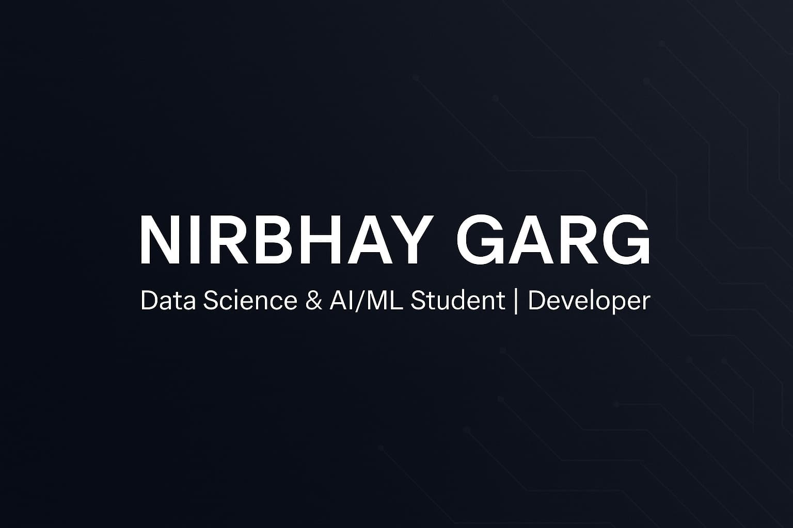

echo '# 🌟 Nirbhay Garg - Portfolio Website
quote> 
quote> A modern, responsive portfolio website showcasing my journey in Data Science and AI/ML developm
ent. Built with cutting-edge technologies and featuring stunning animations, 3D elements, and a premiu
m user experience.
quote> 
quote> 
quote> 
quote> ## ✨ Features
quote> 
quote> - **Modern Design**: Clean, professional interface with glass morphism effects
quote> - **Responsive Layout**: Optimized for all devices and screen sizes
quote> - **3D Elements**: Interactive Three.js components for enhanced visual appeal
quote> - **Smooth Animations**: Framer Motion powered animations and transitions
quote> - **Contact Form**: Functional contact form with Formspree integration
quote> - **Dark Theme**: Beautiful dark theme with gradient accents
quote> - **Performance Optimized**: Built with Vite for lightning-fast loading
quote> - **TypeScript**: Fully typed codebase for better development experience
quote> 
quote> ## 🚀 Tech Stack
quote> 
quote> ### Frontend
quote> - **React 18** - Modern React with hooks and functional components
quote> - **TypeScript** - Type-safe JavaScript
quote> - **Vite** - Next-generation frontend tooling
quote> - **Tailwind CSS** - Utility-first CSS framework
quote> - **Framer Motion** - Production-ready motion library
quote> - **Three.js** - 3D graphics library via @react-three/fiber
quote> 
quote> ### UI Components
quote> - **Radix UI** - Headless UI components
quote> - **shadcn/ui** - Beautiful, accessible component library
quote> - **Lucide React** - Modern icon library
quote> 
quote> ### Build Tools
quote> - **ESLint** - Code linting and formatting
quote> - **PostCSS** - CSS processing
quote> - **Bun** - Fast package manager and runtime
quote> 
quote> ### Backend Integration
quote> - **Supabase** - Backend as a Service
quote> - **Formspree** - Contact form handling
quote> 
quote> ## 📁 Project Structure
quote> 
quote> ```
quote> src/
quote> ├── components/           # React components
quote> │   ├── ui/              # Reusable UI components (shadcn/ui)
quote> │   ├── AboutSection.tsx # About me section
quote> │   ├── ContactSection.tsx # Contact form and info
quote> │   ├── CustomCursor.tsx # Custom cursor component
quote> │   ├── HeroSection.tsx  # Landing/hero section
quote> │   ├── Navigation.tsx   # Navigation component
quote> │   ├── ProjectsSection.tsx # Projects showcase
quote> │   └── SkillsSection.tsx # Skills and technologies
quote> ├── hooks/               # Custom React hooks
quote> ├── integrations/        # Third-party integrations
quote> │   └── supabase/       # Supabase configuration
quote> ├── lib/                # Utility functions
quote> ├── pages/              # Page components
quote> │   ├── Index.tsx       # Main portfolio page
quote> │   └── NotFound.tsx    # 404 page
quote> └── App.tsx             # Main application component
quote> ```
quote> 
quote> ##🛠️ Installation & Setup
quote> 
quote> ### Prerequisites
quote> - Node.js (v18 or higher)
quote> - Bun (recommended) or npm/yarn
quote> 
quote> ### Clone the Repository
quote> ```bash
quote> git clone https://github.com/Nirbhay2007/Portfolio.git
quote> cd Portfolio
quote> ```
quote> 
quote> ### Install Dependencies
quote> ```bash
quote> # Using Bun (recommended)
quote> bun install
quote> 
quote> # Or using npm
quote> npm install
quote> 
quote> # Or using yarn
quote> yarn install
quote> ```
quote> 
quote> ### Environment Setup
quote> Create a `.env.local` file in the root directory:
quote> ```env
quote> VITE_SUPABASE_URL=your_supabase_url
quote> VITE_SUPABASE_ANON_KEY=your_supabase_anon_key
quote> ```
quote> 
quote> ### Run Development Server
quote> ```bash
quote> # Using Bun
quote> bun run dev
quote> 
quote> # Or using npm
quote> npm run dev
quote> 
quote> # Or using yarn
quote> yarn dev
quote> ```
quote> 
quote> Visit `http://localhost:5173` to view the portfolio.
quote> 
quote> ## 📝 Available Scripts
quote> 
quote> - `bun run dev` - Start development server
quote> - `bun run build` - Build for production
quote> - `bun run build:dev` - Build in development mode
quote> - `bun run preview` - Preview production build
quote> - `bun run lint` - Run ESLint
quote> 
quote> ## 🎨 Customization
quote> 
quote> ### Personal Information
quote> Update personal details in the following components:
quote> - `src/components/HeroSection.tsx` - Name and introduction
quote> - `src/components/AboutSection.tsx` - About me content and stats
quote> - `src/components/ContactSection.tsx` - Contact information and social links
quote> 
quote> ### Skills & Technologies
quote> Modify your skills in:
quote> - `src/components/SkillsSection.tsx` - Technical skills and proficiency levels
quote> - `src/components/AboutSection.tsx` - Tech stack highlights
quote> 
quote> ### Projects
quote> Add or update projects in:
quote> - `src/components/ProjectsSection.tsx` - Project showcase and certificates
quote> 
quote> ### Styling
quote> - Update colors in `tailwind.config.ts`
quote> - Modify global styles in `src/index.css`
quote> - Customize component styles using Tailwind classes
quote> 
quote> ## 🌐 Deployment
quote> 
quote> ### Vercel (Recommended)
quote> 1. Push your code to GitHub
quote> 2. Connect your repository to Vercel
quote> 3. Set environment variables in Vercel dashboard
quote> 4. Deploy!
quote> 
quote> ### Netlify
quote> 1. Build the project: `bun run build`
quote> 2. Upload the `dist` folder to Netlify
quote> 3. Set environment variables in Netlify dashboard
quote> 
quote> ### Other Platforms
quote> The built files are in the `dist` directory after running `bun run build`.
quote> 
quote> ## 📱 Contact Form Setup
quote> 
quote> The contact form uses Formspree for handling submissions. To set it up:
quote> 
quote> 1. Sign up at [Formspree](https://formspree.io)
quote> 2. Create a new form
quote> 3. Update the form action URL in `ContactSection.tsx`
quote> 4. Replace `https://formspree.io/f/xldnogod` with your form endpoint
quote> 
quote> ## 🤝 Contributing
quote> 
quote> While this is a personal portfolio, suggestions and improvements are welcome!
quote> 
quote> 1. Fork the repository
quote> 2. Create a feature branch (`git checkout -b feature/amazing-feature`)
quote> 3. Commit your changes (`git commit -m "Add some amazing feature"`)
quote> 4. Push to the branch (`git push origin feature/amazing-feature`)
quote> 5. Open a Pull Request
quote> 
quote> ## 📄 License
quote> 
quote> This project is open source and available under the [MIT License](LICENSE).
quote> 
quote> ## 👤 About Me
quote> 
quote> I'"'"'m **Nirbhay Garg**, a B.Tech undergraduate specializing in Data Science and AI/ML. Passio
nate about creating impactful digital solutions and exploring the intersection of technology and innov
ation.
quote> 
quote> ### Connect with Me
quote> - 🌐 **Portfolio**: [nirbhaygarg.com](https://nirbhaygarg.com)
quote> - 💼 **LinkedIn**: [linkedin.com/in/nirbhaygarg](https://linkedin.com/in/nirbhaygarg)
quote> - 🐙 **GitHub**: [github.com/Nirbhay2007](https://github.com/Nirbhay2007)
quote> - 🐦 **Twitter**: [@Nirbhay1030](https://x.com/Nirbhay1030)
quote> - 📧 **Email**: contact@nirbhaygarg.com
quote> 
quote> ## 🙏 Acknowledgments
quote> 
quote> - [shadcn/ui](https://ui.shadcn.com/) for the beautiful component library
quote> - [Framer Motion](https://www.framer.com/motion/) for smooth animations
quote> - [Three.js](https://threejs.org/) for 3D graphics
quote> - [Tailwind CSS](https://tailwindcss.com/) for styling
quote> - [Lucide](https://lucide.dev/) for icons
quote> 
quote> ---
quote> 
quote> ⭐ If you found this portfolio helpful, please consider giving it a star on GitHub!
quote> 
quote> **Currently open to internships and collaboration opportunities!** 🚀' > README.md
nirbhay_garg@nirbhay-gargs-MacBook-Air ~ % 